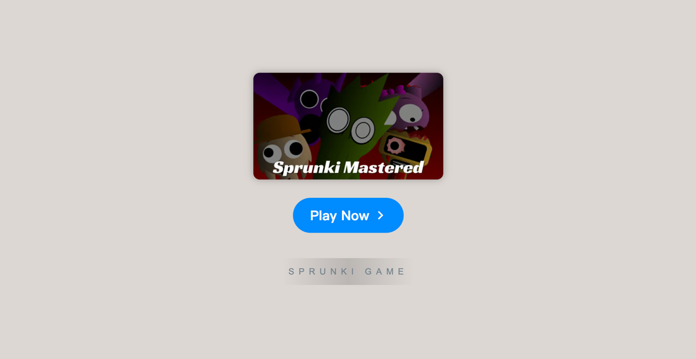

# Sprunki Mastered

    

Explore **[Sprunki Mastered Game](https://sprunkionline.com/mastered)**, the thrilling evolution of the original Sprunki universe. With a fresh take on sound creation and an enhanced gameplay experience, Sprunki Mastered pushes the boundaries of creativity and music. Whether you're a newcomer or a long-time fan, this game will challenge your musical skills in unexpected ways, offering a deeper and more engaging experience than ever before.

### Table of Contents
- Introduction
- Features
- Installation
- Gameplay Overview
- Phases in Sprunki Mastered
- Popular Mods & Customizations
- Tips for Mastering the Game
- Community Resources

### Introduction

**Sprunki Mastered** builds on the iconic Incredibox formula, but with an exciting new twist. Featuring new characters, original soundtracks, and creative mods, the game immerses players in a world where music creation meets captivating visuals. Whether you're looking to experiment with different sounds or enjoy the creative freedom that comes with the game, Sprunki Mastered has something for everyone. You can jump into the game directly in your browser and start composing immediately.

### Features

| Feature                     | Description                                                                                     |
|-----------------------------|-------------------------------------------------------------------------------------------------|
| **Custom Sound Creation**   | Craft unique music by combining various character sounds and beats.                             |
| **Multiple Phases**         | Enjoy a variety of stages with distinctive themes and characters for endless musical exploration.|
| **Infected Mode**           | Add a dark, quirky twist to your compositions with the Infected mod.                             |
| **Mustard Sprunki**         | One of the most popular characters, offering a distinct musical touch.                           |
| **No Download Required**    | Play directly from your browser—no installation needed.                                          |
| **Free Access**             | All features and mods are available to you at no cost.                                          |
| **Community Sharing**       | Save your creations, share them with the community, and receive feedback from fellow players.    |

### Installation

To get started with **Sprunki Mastered**, follow these simple steps:

1. **Open Your Browser**: Make sure you're using a modern browser like Chrome, Firefox, or Safari.
2. **Visit the Game Pages**:
    - [Sprunki Mastered](https://sprunkionline.com/mastered)
3. **Start Playing**: Click "Play" to enter the world of Sprunki and begin creating music.

### Gameplay Overview

Sprunki Mastered is an innovative game that lets players become composers by mixing sounds and creating their own beats:

1. **Select Characters**: Choose from a wide range of characters, each associated with unique sounds and effects.
2. **Build Your Beat**: Drag and drop characters into the game area to create a complex and layered musical composition.
3. **Save & Share**: Once your masterpiece is complete, save it and share it with the Sprunki community for feedback.

### Phases in Sprunki Mastered

**Sprunki Mastered** features various phases, each offering a distinct audio-visual experience:

| Phase                 | Description                                                                                         |
|-----------------------|-----------------------------------------------------------------------------------------------------|
| **Sprunki Phase 3**    | Classic beats with new characters, exploring different musical genres and soundscapes.              |
| **Sprunki Phase 4**    | A futuristic phase that introduces high-energy rhythms and digital-inspired sounds.                  |
| **Sprunki Phase 5**    | Darker and more atmospheric, with intense beats that challenge players' creativity and rhythm skills. |

### Popular Mods & Customizations

**Sprunki Mastered** offers a variety of mods and customization options to enhance your gameplay experience:

- **Infected Mode**: A popular mod that adds eerie sounds and unexpected changes to your compositions.
- **Custom Characters**: Players can unlock and create new characters to introduce more variety into their mixes.
- **Collaborative Play**: Team up with other players to create joint musical compositions and share your creations.

### Tips for Mastering the Game

- **Experiment with Layers**: Don’t be afraid to combine different characters and sounds. The more layers you add, the more complex and interesting your composition will become.
- **Use the Infected Mode**: This mod can add an extra dimension to your tracks by introducing unexpected elements and twists.
- **Share and Get Feedback**: Join the community and share your mixes. Getting feedback will help you improve and inspire new ideas for your next creation.

### Community Resources

- **Sprunki Forums**: Join the conversation and share your experiences with other players.
- **Tutorials and Guides**: Access various tutorials to learn new techniques and improve your musical skills in the game.
- **Sprunki Discord**: Connect with other creators, discuss strategies, and collaborate on projects.
